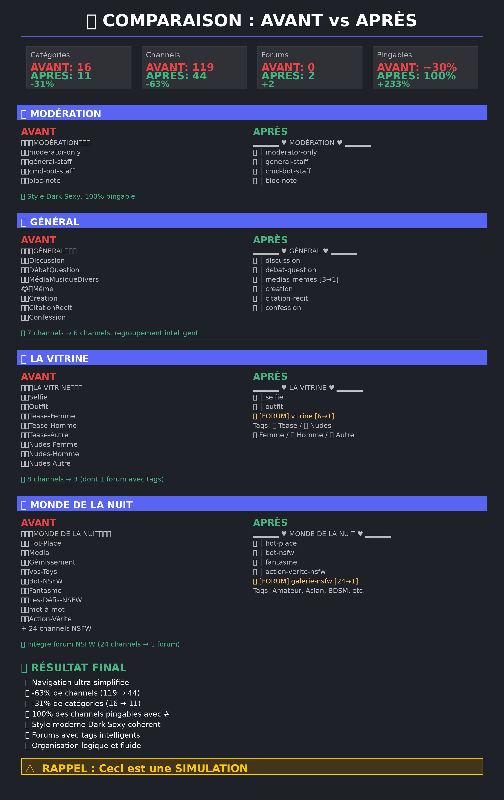

# 🎨 COMPARAISON VISUELLE : AVANT vs APRÈS

## 📊 Optimisation Complète du Serveur Discord

Cette image présente une comparaison détaillée de l'état actuel du serveur Discord et de sa version optimisée.

---

## 🖼️ Image de Comparaison

---

## 📈 Statistiques Principales

| Métrique | AVANT | APRÈS | Gain |
|----------|-------|-------|------|
| **Catégories** | 16 | 11 | **-31%** 🔥 |
| **Channels** | 119 | 44 | **-63%** 🔥 |
| **Forums** | 0 | 2 | **+2** ✨ |
| **Channels Pingables** | ~30% | 100% | **+233%** ✅ |

---

## 🎯 Principaux Changements

### ✅ Optimisations Majeures

- **Style Dark Sexy** : Tous les noms de channels et catégories renommés avec un style moderne et élégant
- **100% Pingable** : Tous les channels peuvent être mentionnés avec 
- **Forums Intelligents** : 30 channels regroupés en 2 forums avec système de tags
- **Suppressions** : Catégorie RP/ERP complète + channels inutilisés (gémissements, toys, défis-nsfw)
- **Regroupements** : Medias+Memes, Boutique+Géolocalisation+Jeux-bot, Logs thématiques

### 🔥 Les 2 Forums

#### Forum 1: 
Remplace 6 channels (Tease-Femme, Tease-Homme, Tease-Autre, Nudes-Femme, Nudes-Homme, Nudes-Autre)

**Tags disponibles :**
- Contenu : 💃 Tease | 🔥 Nudes
- Genre : 💄 Femme | 👔 Homme | 🧢 Autre

#### Forum 2: 
Remplace 24 channels NSFW en un seul forum organisé

**Tags disponibles :**
💙 Amateur • 🏯 Asian • 🍑 Ass • 🪢 BDSM • 🥱 Blowjobs • 🍒 Boobs • 👗 Exhib • 🥛 Creampie • 🍆 Dick • 😮 Face-Fuck • 🦶 Feet • 🥒 Femboy • 🫣 Fuck • ✋ Handjob • 🩸 Hard • 🩱 Latex • 👅 Milfs • 🌳 Public • 🐱 Pussy • 🪄 Vanilla • 🧸 Toys • 🦋 Trans • 🫦 Lick • 🤖 IA

---

## ✨ Avantages Finaux

✅ **Navigation ultra-simplifiée** : Moins de scroll, organisation claire  
✅ **Réduction massive** : -63% de channels, -31% de catégories  
✅ **Modernité** : Forums avec tags, style cohérent  
✅ **Accessibilité** : 100% des channels pingables  
✅ **Fluidité** : Regroupements logiques et intuitifs  

---

## ⚠️ Important

**Ceci est une SIMULATION** - Aucune modification n'a été appliquée au serveur Discord réel.

Ces analyses servent de référence pour planifier les changements avant leur mise en œuvre.

---

## 🔗 Liens Utiles

- [Documentation complète](./README.md)
- [Version Markdown](./comparaison_visuelle.md)
- [Détail des regroupements de logs](./detail_regroupement_logs.txt)
- [Plan de migration](./guide_migration_visuel.txt)

---

*Généré automatiquement le 16/11/2025*
